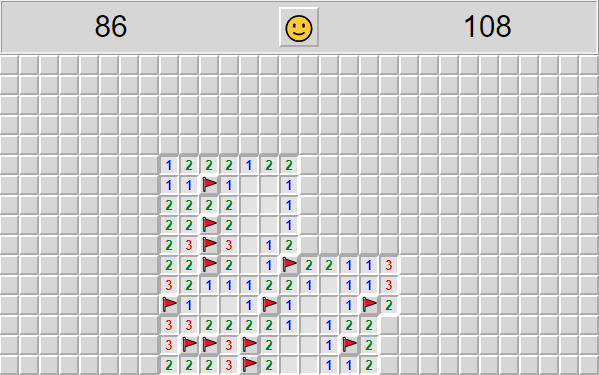

# react-minesweeper

This is a mine sweeping game implemented in Javascript using React for
the user interface. The game can be played at:
https://veeem.github.io/react-minesweeper

## Gameplay

To win the game, reveal every tile that does not contain a mine. The
game is lost if a tile containing a mine is revealed. There are 99
mines in total on the board. A revealed tile indicates with a number
how many mines are adjacent to it.

## Controls

Reveal a tile - left mouse button

Place a flag - right mouse button

Perform a chord - middle mouse button

## What is a chord?

When all mines adjacent to a revealed tile are marked with a flag, a
chord can be performed on that tile. Performing a chord on a tile
reveals all unflagged tiles adjacent to it. The game is lost if the
flags are placed incorrectly when performing a chord.
